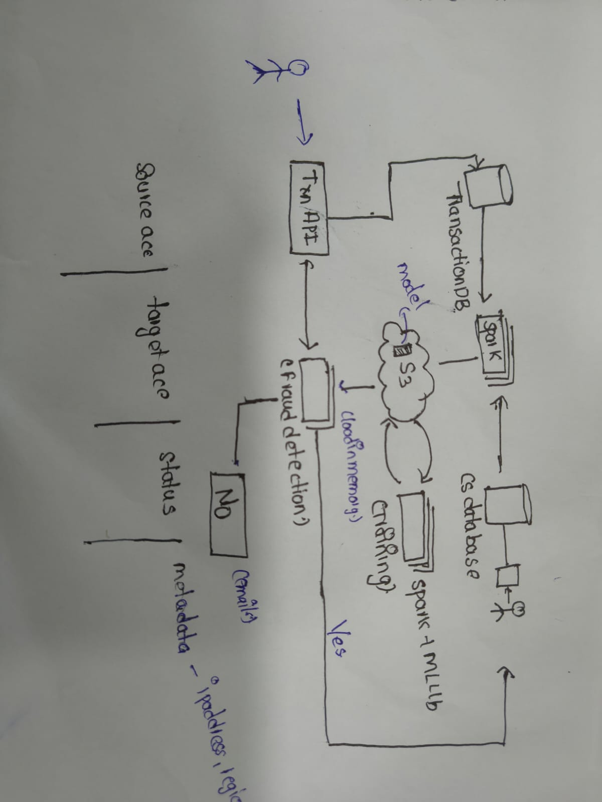

# Trust Graph — Project Explanation (a simple walkthrough)

This document explains what **Trust Graph** is, why it exists, what we used to build it,
and how each piece works. It is written in plain language — no assumption that you
already know fraud detection, graph databases, or even machine learning.

---

## 1. What is this project about?

**Picture a marketplace like Amazon or Flipkart.** Buyers buy, sellers sell, and
delivery partners bring the goods. It looks simple — but underneath there are bad actors
quietly committing fraud:

- A seller lists fake products, then "buys" from their own store using fake accounts to
  inflate ratings.
- A seller coordinates with a few fake customers who all use *the same phone or the same
  Wi-Fi IP* — so a rule like "this account is new and returns a lot" sees nothing
  wrong, because every single transaction on its own looks normal.
- A delivery partner marks parcels delivered that were never delivered.

**The core problem:** single transactions look innocent on their own. Fraud is almost
always about *who is connected to whom* — a device, an IP address, or money flowing
between accounts.

Trust Graph is a fraud detection + action system that:

1. Uses a **points-based rules engine** (like a careful scorecard),
2. Uses **machine learning** (two models trained on labeled examples),
3. Uses a **graph database** (a map of how every actor is connected),

…then decides what to *do* about each risky actor, explains why in plain language,
records every decision for audit, lets the seller **appeal**, and double-checks that
decisions are **fair** and **accurate enough** to be made automatically.

It was built for the **AI Build 2026 · Track 5 (Trust Graph)** application.

---

## 2. The problem, restated simply

| Term from the problem | Plain meaning |
|---|---|
| "Multi-actor fraud" | Theft that profits from *several* accounts working together |
| "Collusion" | People secretly cooperating (sellers + fake customers sharing devices) |
| "Detection is siloed and rule-based" | Old systems check each account alone; they can't see the network |
| "Graduated remediation" | Start with a light stop, escalate step by step, suspend last |
| "Human reviewable, appeal path" | A flagged seller can push back, and a real person settles it |

**The one line:** *See fraud that acts like a GROUP hiding inside normal single
transactions — and act on it fairly, explain why, and let the person appeal.*

---



## 3. The stack, in one picture

```
┌──────────────────────────────────────────────────┐
│  WEB APP (Next.js)  — the investigation desk     │
│  cases · sellers · graph · appeals · audit · demo│
└───────────────┬──────────────────────────────────┘
                │  REST API calls (localhost:4000)
┌───────────────▼──────────────────────────────────┐
│  TRUST GRAPH API (Node.js + TypeScript)          │
│  risk analysis · cases · appeals · audit · fair   │
└──────┬──────────────┬──────────────┬─────────────┘
       │              │              │
┌──────▼─────┐  ┌──────▼───────┐  ┌───▼─────────────────┐
│ PostgreSQL │  │    Neo4j      │  │ Python ML services  │
│   (facts)  │  │ (connections) │  │ :8000 XGBoost       │
│            │  │              │  │ :8001 GraphBoost     │
└────────────┘  └──────────────┘  └─────────────────────┘
```

Three "brains" feed every decision:

- **PostgreSQL** — the *fact book*: sellers, orders, transactions, fraud cases, appeals.
- **Neo4j** — the *map*: who is connected to whom
  (customer → device, customer → IP, customer → seller).
- **Python ML** — the *pattern recognizers*: two small services that return
  "how sure am I that this is fraud".

---

## 4. How a transaction is analyzed (the main flow)

When an investigator clicks "Analyze" on a transaction:

```
1.  Ask PostgreSQL   → seller facts: amounts, refunds, account age, order velocity
2.  Ask Neo4j        → does this seller share a device or IP with anyone?
3.  Ask XGBoost      → "transaction-style" fraud probability         (port 8000)
4.  Ask GraphBoost   → "graph-style" fraud probability               (port 8001)
5.  Ask AbuseIPDB    → live reputation of involved IP addresses
6.  Blend everything → one weighted score 0–100 + a level
7.  Decide action    → ALLOW / STEP_UP_VERIF / HUMAN_REVIEW / PAYOUT_HOLD
8.  Apply guardrail  → if the system isn't accurate enough, a human reviews instead
9.  Explain          → build a plain-language summary of *why*
10. Store everything → risk signals in PostgreSQL, action in the audit log
```

Implemented in `server/src/risk/calculateRisk.ts`, with the ML services behind
`server/src/services/mlService.ts`.

---

## 5. The scoring engine (the "risk scorecard")

Final score = a weighted mix of 9 signals:

| Signal | Weight | What it watches |
|---|---|---|
| ML fraud probability (XGBoost) | 20% | "This transaction looks like fraud" |
| Graph risk (Neo4j) | 20% | "This seller shares devices/IPs with others" |
| Transaction amount | 12% | Suspiciously large payouts |
| Refund rate | 12% | Abnormal returns |
| IP reputation (AbuseIPDB) | 8% | A known-abusive IP |
| Device linkage | 8% | One device linked to many accounts |
| Account age | 8% | Brand-new accounts |
| Order velocity | 8% | Burst of orders in 24h |
| Dispute rate | 4% | Customer disputes |

Total maps to four levels:

```
0–29   → LOW      → ALLOW
30–54  → MEDIUM   → STEP_UP_VERIFICATION   (soft: extra verification)
55–74  → HIGH     → HUMAN_REVIEW           (a person looks at it)
75–100 → CRITICAL → PAYOUT_HOLD            (hard: don't pay yet)
```

This is the **graduated ladder** from the problem statement: a warning first, a person
in the middle, money frozen only at the top.

---

## 6. The two ML models

### XGBoost → transaction model (port 8000)
- A fast, widely-used tree-based classifier.
- Trained on labeled examples (amount, refund rate, account age, IP risk, velocity…).
- Predicts `fraud_probability`; can **explain** each prediction with **SHAP**
  (`Shapley Additive exPlanations`) — a method that reports feature-level impact:
  *these three features pushed it toward fraud, in this direction, by this much.*

### GradientBoosting → graph model (port 8001)
- The second, graph-only classifier.
- Trained on *graph-topology* features: degree, clustering coefficient, PageRank,
  neighbor fraud rate, shared device/IP counts.
- Its job: catch **fraud rings** — clusters of otherwise-normal actors wired together
  through shared devices/IPs back to known bad actors.

Two independent eyes: one sees the individual transaction, the other sees the
neighborhood. The score combines both.

---

## 7. The graph database (Neo4j) — the heart of collusion detection

A graph database stores **nodes** (things) and **edges** (connections):

```
(Customer) -[USES_DEVICE]→ (Device)     ← one phone used by 5 accounts
(Customer) -[USES_IP]→     (IP)         ← one Wi-Fi used by several accounts
(Customer) -[PLACED_ORDER]→(Seller)
```

Trust Graph uses it to answer:

- "How many accounts have logged in from this device?" → flag if more than 2.
- "This seller and a customer use the same phone" → a classic collusion signature.
- "How far is this node from a known bad actor?" → bridge/cluster detection.

Endpoints:

| Endpoint | Gives you |
|---|---|
| `GET /api/graph/entire-graph` | The full node+edge map for the UI |
| `GET /api/graph/neighbors?nodeId=` | The neighborhood around any single node |
| `GET /api/graph/stats` | Node/edge counts, suspicious devices |
| `GET /api/graph/verdicts` | Every seller → SAFE/SUSPICIOUS/RISKY/HIGH_RISK with reasons |
| `GET /api/graph/seller/:id/risk` | Per-seller graph-risk breakdown |

In the dashboard **/dashboard/graph** you can *see* the map: sellers, customers,
devices and IPs as circles with links — red = suspected, amber = shared usage. Clicking
a node shows its **verdict + reasons** so you understand why the system thinks so.

---

## 8. Proof on real data: the Elliptic benchmark

The challenge says: prove your graph technique on a *real, public, labeled* dataset,
not only on your synthetic data. So the repo has an offline benchmark running the
**Elliptic Bitcoin Dataset** (`ml/graph/train_elliptic.py`):

- 203,769 transaction nodes and 234,355 directed edges (Bitcoin transfers)
- 4,545 labeled *licit* + 42,019 labeled *illicit*
- Time-based split (train on early months, test on later unseen months)

Two XGBoost models trained on the same test set:

| Model | Precision | Recall | F1 | AUC |
|---|---|---|---|---|
| Node features only (a single-tx classifier) | 0.9810 | 0.9954 | 0.9882 | 0.9398 |
| **Node + Graph features** | **0.9829** | **0.9978** | **0.9903** | **0.9667** |

**The key result:** the graph-augmented model **caught 51 illicit transactions the
node-only model missed**, while disturbing only 5 licit ones. This is the entire point
of the track: collusion can't be caught when you look at transactions one-by-one; the
graph signals (neighbor labeled priors, degree, core numbers) unveil laundering
clusters invisible at row level.

---

## 8. The safety mechanisms

A fraud engine can't just fire whatever it wants. Stand three guards:

### 1. Precision guardrail (`server/src/risk/guardrail.ts`)
Before any automated action the system measures its own precision on the last ~200
cases. **Precision = how many of its fraud flags were correct.**

- LOW / MEDIUM risk → still automates (low stakes).
- HIGH risk → **only** automates if precision ≥ 95% and sample ≥ 100, otherwise a
  human investigates.
- CRITICAL → always a human.

This satisfies the challenge guardrail: *automated hard actions require ≥ 95% precision,
otherwise route to human.*

### 2. Fairness monitoring (`server/src/risk/fairness.ts`)
Groups every flag by seller tenure — new (< 30 days), established (30–365), veteran
(> 365) — and checks:

- **Disparate impact**: no group flagged less than 80% as often as the most-flagged one.
- **Equal opportunity**: true-positive rates similar across groups.
- **Demographic parity**: prediction rates don't drift apart.

If a threshold breaks, the API recommends a fix. This handles: *don't concentrate
actions on small or brand-new participants.*

### 3. Audit & appeals
- Every decision lands in an **audit log** — immutable trail of who did what when.
- A flagged seller can submit an **appeal** (`/api/appeals`) which reviewers own; the
  entire history stays attached to the original case so a human (and the accused) can
  see "why".

---

## 9. The user experience

Once logged in as an admin, you get a full investigation desk:

| Page | Purpose |
|---|---|
| **Dashboard** | Overview + quick links |
| **Cases** | All fraud cases; drill into any, see score, signals, timeline |
| **Sellers** | Seller profiles; flag/unflag with reasons |
| **Transactions** | Ledger; analyze any transaction inline |
| **Graph** | Live Neo4j map — risk colors, mini-map, node verdicts |
| **Appeals** | The reviewer workflow |
| **Audit** | Immutable timeline |
| **Demo** | Live runner: pick a scenario and watch ML + SHAP + narrative |

A store works too: sign up with roles (admin / seller / customer), sellers create
products, a primary-product catalog, a cart, and checkout.

---

## 10. Data flow, everything in one recap

```
React page → fetch() → Trust Graph API (Node) ─→ PostgreSQL (facts)
                                             ├→ Neo4j (connections)
                                             ├→ XGBoost :8000 (transaction ML)
                                             ├→ GraphBoost :8001 (graph ML)
                                             └→ AbuseIPDB + GSTIN (live checks)
API → composes all → score + level + explanation → page shows it
API → writes FraudCase + AuditLog → the investigator owns an evidence trail
API → guardrail checks precision → hard actions human-reviewed before auto
API → fairness report → shows if a small/new seller is being hit unfairly
```

---

## 11. Where the requirements were hit

| Track requirement | Where it lands |
|---|---|
| Learn/graph fraud | XGBoost + GraphBoost, rated on Elliptic (51 extra caught) |
| Graph-based anomaly | Neo4j + structural features + graph UI |
| Explainable | SHAP + plain-language narrative |
| Graduated remediation | ALLOW → STEP_UP → HUMAN_REVIEW → PAYOUT_HOLD |
| ≥ 95% precision for auto actions | Guardrail; CPU / GPU human-review fallback |
| Fairness | Cohort parity metrics |
| Real data / proof | Elliptic benchmark + AbuseIPDB/GSTIN live APIs |

---

## 12. Honest notes

This is a strong MVP. Things a larger build would still take on:

- **The two served ML models train on synthetic samples**; the Elliptic benchmark is
  real but it's separate — retraining the served models on IEEE-CIS / the Indian
  fraud dataset would strengthen the answer.
- **Delivery partner / GPS / proof-of-delivery** events aren't modeled yet.
- **Return-and-refund abuse** is just a signal (`refund_rate`), not a standalone flow.
- There's no separate hard **suspension** state beyond `PAYOUT_HOLD`.
- **Appeal SLA** (e.g. decide within 48h) is not enforced.
- **Email/SMS notifications** (SendGrid/Twilio) are stubs — no notifications API yet.
- **Cost-per-decision** and a self-check step are still TODO.

---

*This file is intended as a plain-language walkthrough. For raw technicals, see
[`README.md`](../README.md).*